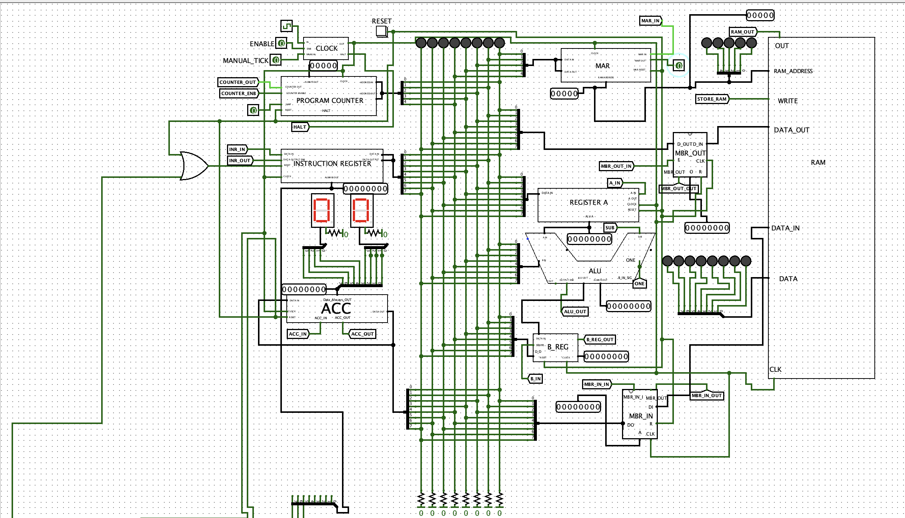
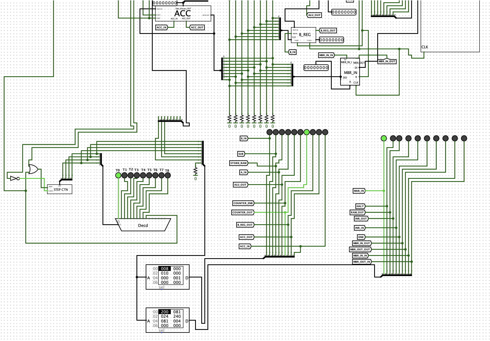
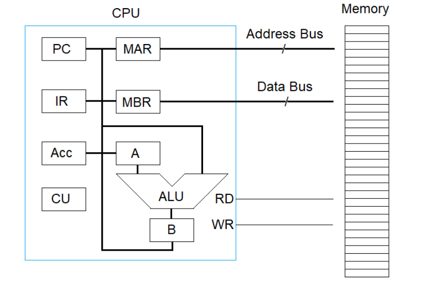
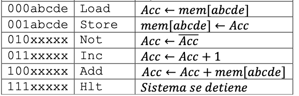

# What is this?
This is a 32* 8 accumulator based CPU made in Logisim 2.7.1.

**Figure 1**: Schematics for CPU excluding Control Unit.

**Figure 2**: Schematics for CPU Control Unit.

**Figure 3**: General structure of CPU.

**Figure 4**: Instructions,op-code and operation table.

## Aims
This proyect aims to teach how a microprocessor works, it is based on a  accumulator Von Neumann architecture. It has a data width of 8 bits and a address width of 5 bits, so the RAM has 32 addresses. It uses an op-code of three bits so it can perform 8 instructions, only 6 were defined.

## To do:
We made the memory buffer register(MBR) bi-direccional by using two registers, as it can be seen we didnt put the two register in a single component, mainly because of space, though it is something to update. Also as 2 more instructions can be made, conditional jump instructions are a suggested possibility. 

## How to run it?
To run the 8bitCPU.circ you need oracle java enviroment and Logisim 2.7.1 (Logisim is  software made in Java). In MAC OS you need to go to Logisim->Show Package Contents-> Contents->  Resources->Java->logisim.jar and open the file. 

## For more information:
Go to CPUIntro.pdf, this contains an introduction and how to start the system and execute a LOAD instruction.

## Authors:
Hiram Rodríguez
Lucas Martínez
Jose Rodríguez
Josue Colon
